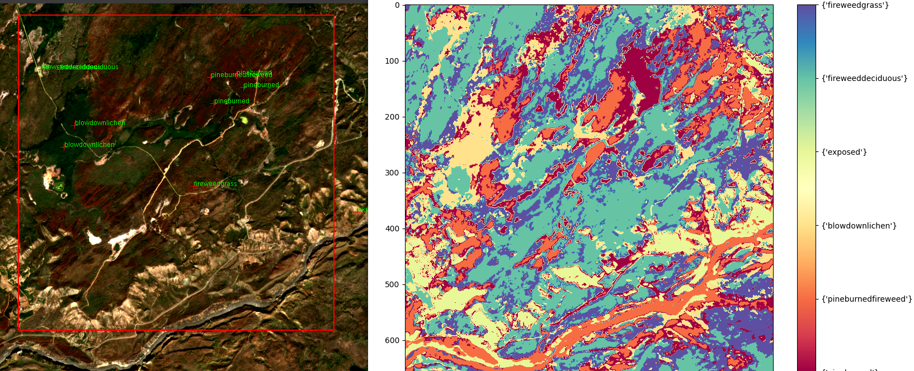
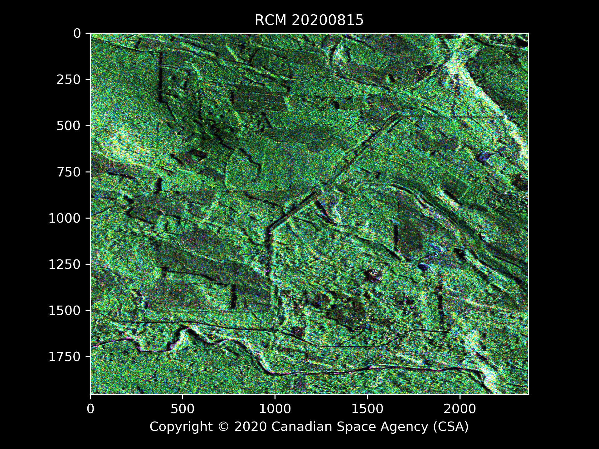

# bcws-psu-research
Methods and Systems for Image Analysis developed in partnership with:
* Digital Platforms and Data Division (DPDD), Office of The BC Chief Information Officer (OCIO) 
* BC Wildfire Service (BCWS) Predictive Services Unit (PSU)
* Thompson Rivers University (TRU)

## Sample results
###  Interactive mapping w BCWS FTL MVP software: end-to-end decision support system (DSS)

### Forest change detection w Canadian Space Agency (CSA) Radarsat Constellation Mission (RCM) compact-pol SAR data

## Features
### BCWS FTL MVP
* Exascale viewer with interactive classification
   * Semi-supervised hybrid classification method
   * Decision-support system keeping humans in the loop
   * Interactively view multitemporal multispectral image stacks of size up to system limit
* Adjustable high-contrast visualization and manipulation of multispectral imagery and classification maps

## Setup:
- Install Oracle virtualbox

## Collaborators and Contributors:
* Dana Hicks, BCWS
* Joanna Wand, BCWS
* Brad Martin, BCWS
* Dr. David Hill, TRU
* Dr. Musfiq Rahman, TRU
* Ashlin Richardson, OCIO

### TRU Computing Science ML/AI Students Co-supervised:
* Gagan Bajwa
* Brad Crump
* Francesca Rammuno

## Alumni:
* Brady Holliday, BCWS
* Jabed Tomal, TRU

## License

Copyright 2021 Province of British Columbia

Licensed under the Apache License, Version 2.0 (the "License");
you may not use these files except in compliance with the License.

You may obtain a copy of the License at
http://www.apache.org/licenses/LICENSE-2.0

Unless req'd by applicable law or agreed to in writing,
software distributed under the License is distributed on an
"AS IS" BASIS, WITHOUT WARRANTIES OR CONDITIONS OF ANY KIND,
either express or implied.

See the License for specific language governing permissions
and limitations under the License.

## References
[1]  Daniel Müllner, fastcluster: Fast Hierarchical, Agglomerative Clustering Routines for R and Python, Journal of Statistical Software 53 (2013), no. 9, 1–18, URL http://www.jstatsoft.org/v53/i09/
