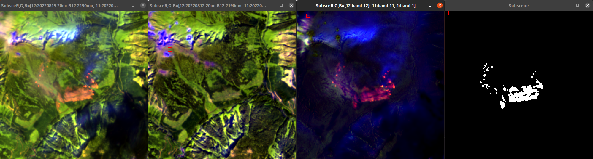
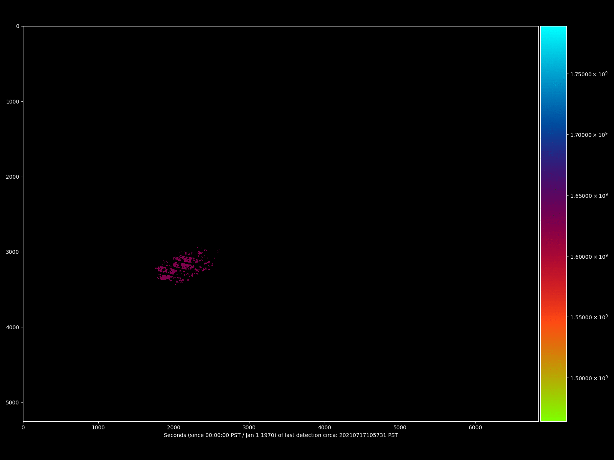
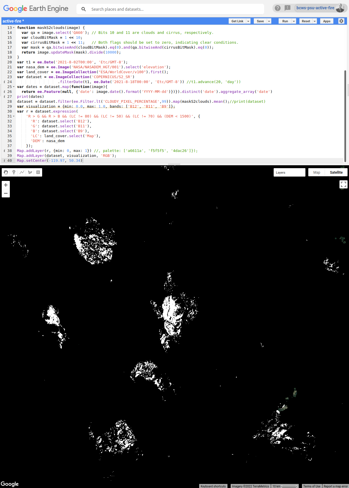
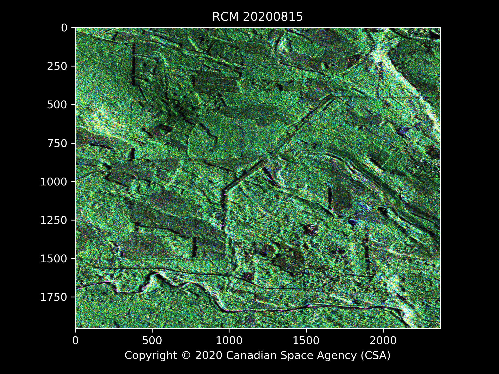

BC Wildfire Service / Predictive Services Unit: Remote-sensing Science R&D Engineering. Motto: "where the future is being made, today!"

# Welcome to wps-research
Methods and Systems for Image Analysis developed with partners incl. Digital Platforms and Data Division (DPDD) / Office of The BC Chief Information Officer (OCIO), BC Wildfire Service (BCWS) Predictive Services Unit (PSU) and Thompson Rivers University (TRU)

supporting BC Wildfire Service (BCWS) Predictive Services Unit (PSU) program. See also:
* [Wildfire Predictive Services](https://github.com/bcgov/wps)

Includes A) data integration B) routines applying or implementing supervised and unsupervised classification, C) visualization and manipulation for high dimensional imagery as well as classification maps

## Projects being operationalized
* [Fire mapping using Sentinel-2](https://github.com/bcgov/wps-fire-perimeter)

# Sample results
## Fire mapping: date differencing and threshold

## Fire progression mapping w Sentinel-2 and Landsat 7/8

## Mapping major fires of 2021 in BC

## Exploring time series of heterogeneous data

## Forest change detection w CSA RCM compact-pol SAR data

##  Interactive mapping w BCWS FTL MVP software: end-to-end DSS

## Presentations
* Satellite Fire Mapping: BCWS Operational Trial 2022, BC Gov GIS CoP F2F, Nov 30, 2022
* Remote Sensing Show and Tell, WildfireSat Mission Knowledge Exchange (KE) Group Meeting, Nov 29, 2022
* All Hazards Application of RCM in BC Part 3, CSA RCM Users Forum, Nov 23, 2022
* Mapping Forest Fires and Fuels in Canada with ALOS-2 SAR data, Joint PI Meeting of JAXA Earth Observation Missions FY2022, Nov 7-11, 2022
* Fuel Type Mapping with Remote Sensing and Machine Learning, Wildland Fire Canada Conference, Nov 1, 2022
* A.I. Fire Perimeter Mapping, CIFFC Geomatics Working Group meeting, Oct 12, 2022
* All Hazards Application of RCM in BC Part 2, CSA RCM Users Forum, May 18, 2022
* Fire mapping with Shortwave Infrared, BC Government Remote Sensing CoP, Apr 13 2022
* Fire mapping with Sentinel-2, BCWS Geomatics CoP, Mar 16 2022
* Remote Sensing and Pattern Recognition in BCWS Predictive Services Unit, BCWS Priorities Forum, Jan 6 2022
* Field Observations and Remote Sensing of Wildland Fuels: A Case Study, Bulkley Valley Research Centre, Oct 8 2021 2021
* All Hazards Application of RCM in BC, CSA RCM Users Group Meeting, Nov 25 2021
* Simple Character Recognition, BC Gov Data Science CoP and Python Programming CoP, May 26 2021
* Semi-supervised Classification of Images in Python, BC Gov Data Science CoP and Python Programming CoP, Mar 31 2021
* Fuel Type Layer Project, BC Gov DM Board on Integrated Data, Mar 3 2021
* Fuel Type Layer Project, BC Gov Fire Behaviour CoP, Feb 22 2021
* Can We Predict Forest Fires Before They Start?, BC Gov Data Science CoP, Nov 24 2020

# BCWS FTL MVP
[Please click here for entry point for BCWS FTL MVP software](https://github.com/bcgov/wps-research/blob/master/imv/)
* Exascale viewer w interactive [2] classification
   * Semi-supervised hybrid classification method
   * Decision-support system: accessible AI keeping humans in the loop
   * Interactively view multitemporal multispectral image stacks of size up to system limit
* Adjustable high-contrast visualization and manipulation of multispectral imagery and classification maps

# Sample exploratory results
* [Predicting some BCGW layers from Sentinel-2 Imagery using RandomForest classifier](https://github.com/bcgov/wps-research/blob/master/data/data_combined/Readme.md)
 
Other classifiers that could be used: Minimum Dist; Max Likelihood; Spectral Angle Mapper; Spectral Information Divergence; SVM; neural net

# Collaborators and Contributors:
* Dana Hicks, BCWS
* Joanna Wand, BCWS
* Brad Martin, BCWS
* Dr. David Hill, TRU
* Dr. Musfiq Rahman, TRU
* Ashlin Richardson, OCIO

## TRU Computing Science ML/AI Students Co-supervised:
* Gagan Bajwa
* Brad Crump
* Francesca Rammuno

# Alumni:
* Brady Holliday, BCWS
* Jabed Tomal, TRU

# License

Copyright 2022 Province of British Columbia

Licensed under the Apache License, Version 2.0 (the "License");
you may not use these files except in compliance with the License.

You may obtain a copy of the License at
http://www.apache.org/licenses/LICENSE-2.0

Unless req'd by applicable law or agreed to in writing,
software distributed under the License is distributed on an
"AS IS" BASIS, WITHOUT WARRANTIES OR CONDITIONS OF ANY KIND,
either express or implied.

See the License for specific language governing permissions
and limitations under the License.

This repository is maintained by the BC Wildfire Service (BCWS) Predictive Services Unit (PSU)

# References
[1]  Daniel Müllner, fastcluster: Fast Hierarchical, Agglomerative Clustering Routines for R and Python, Journal of Statistical Software 53 (2013), no. 9, 1–18, URL http://www.jstatsoft.org/v53/i09/
[2] based on gltZpr by Nigel Stewart

### Resources
[Misc RS / fire resources](https://github.com/bcgov/wps-research/blob/master/RESOURCES.md)
