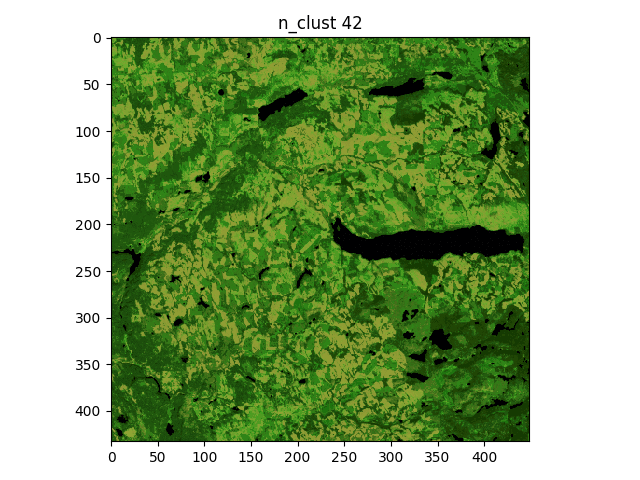
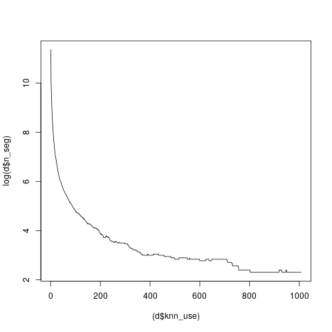

# bcws-psu-research
research software produced in collaboration between BCWS Predictive Service Unit and CITZ DSAB, for image analysis incl:

* multispectral image viewer
* clustering algorithm, a new minimalist implementation of
    * [Unsupervised Nonparametric Classification of Polarimetric SAR Data Using The K-nearest Neighbor Graph](http://ashlinrichardson.com/uvic/papers/2010_richardson_igarss.pdf), A. Richardson et al, proc. IEEE IGARSS, Honolulu, Hawaii, July 2010
    
## requirements:
python 2 (for image viewer) and gnu/g++ (for discretization algorithm); tested on ubuntu

## how to:
1) view the sample input data:

    python read_multispectral.py sentinel2_cut.bin

2) compile and run the clustering algorithm:

    ./run.sh

## Results
### Discretized image output (unsupervised classification): r,g,b <- bands 12, 9, 3
Taking K, the number of k-nearest neighbours to be: 222, 444 and 666 resp.:

### How the number of clusters changes by varying K (the number of K-nearest Neighbours)
y = log(n_segments), x = number of k-nearest neighbours 

Hypothetically for a one-level analysis (non-hierarchical) taking K=100 is highly information-preserving choice, as the curve seems to depart strongly from monotonicity after K=200..

..hence K=200 or so provides efficiency without excessive info. loss
### output formats
The clustering algorithm output is provided in two formats:

    1) Cluster labels in IEEE 32-bit Floating-point format: 0. unlabelled, labels start at 1.
        
    2) Image where the pixels are colored according to the cluster "centres" to which they're assigned
