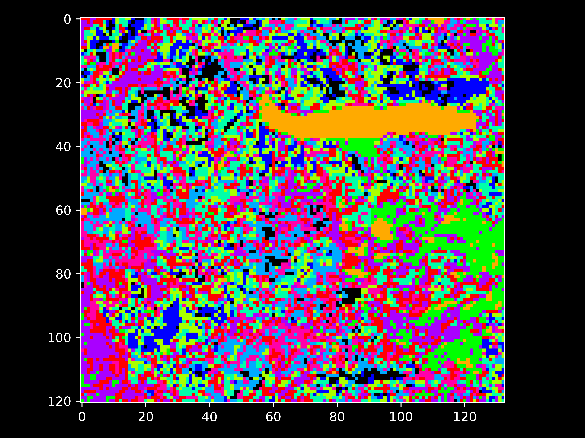
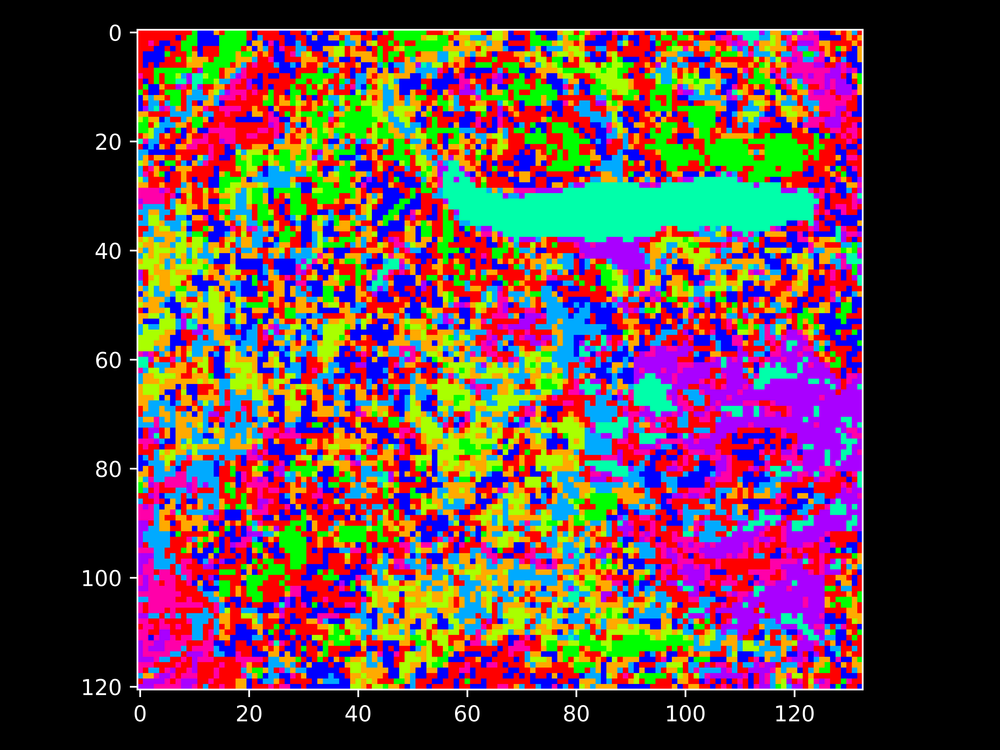
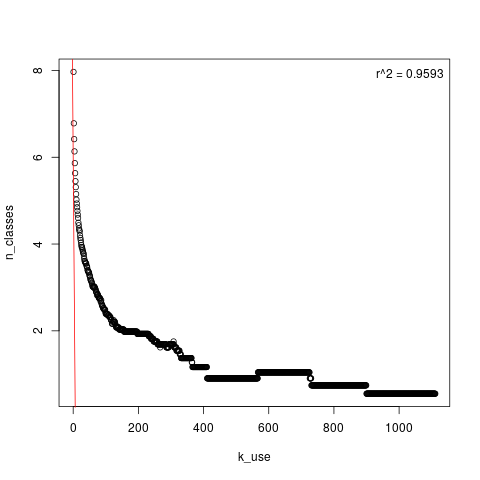

# bcws-psu-research
Research collaboration in Image Analysis featuring:
* Thompson Rivers University (TRU)
* BC Wildfire Service (BCWS) Predictive Services Unit (PSU)
* Digital Platforms and Data Division (DPDD), Office of The BC Chief Information Officer (OCIO) 

## features
* High-contrast visualization for multispectral imagery and classification maps
* Supervised and unsupervised classification methods, for multispectral imagery
   * K-Means++
   * Hierarchical Agglomerative Clustering (HAC) Scikit-Learn 
   * HAC: Daniel Müllner, fastcluster: Fast Hierarchical, Agglomerative Clustering Routines for R and Python, Journal of Statistical Software 53 (2013), no. 9, 1–18, URL http://www.jstatsoft.org/v53/i09/
* manipulation or visualization of class maps (i.e., truth data or classification results)
* clustering algorithm, a new minimalist implementation of
    * [Unsupervised Nonparametric Classification of Polarimetric SAR Data Using The K-nearest Neighbor Graph](http://ashlinrichardson.com/uvic/papers/2010_richardson_igarss.pdf), A. Richardson et al, proc. IEEE IGARSS, Honolulu, Hawaii, July 2010

To appear: more utilities for integrating open remotely-sensed imagery

## Direct Collaborators and Contributors:
* Brady Holliday, BCWS
* Dana Hicks, BCWS
* Joanna Wand, BCWS
* Musfiq Rahman, TRU
* Jabed Tomal, TRU

### TRU Computing Science ML/AI Students Co-supervised:
* Gagan Bajwa
* Brad Crump
* Francesca Rammuno

## requirements:
* python 2
* gnu g++

Tested on ubuntu

## how to:
0) Set up the programs:
    python setup.py
    
1) View sample input data:

    python py/read_multispectral.py data/mS2.bin
    
2) Run K-Means clustering on the sample data:

    python py/kmeans.py data/mS2.bin

3) Run Hierarchical Agglomerative Clustering (HAC) on sample data:

    python py/fast_cluster.py data/mS2.bin
 
4) Run HAC to produce tiled seeds:
    
    python py/fast_cluster_tiling.py data/mS2.bin 50 5 24.5
    
5) Run HAC with seeds produced by 4), allowing HAC to run on larger images

    bin/hclust data/mS2.bin data/mS2.bin_label.bin 10
   
## Preliminary Results

### K-means unsupervised classification

### Hierarchical Agglomerative Clustering (HAC) unsupervised classification
10 clusters:  

### unsupervised classification: an original method
10 clusters:  

#### How the number of clusters changes by varying K (the number of K-nearest Neighbours) for the latter method
y = log(n_segments), x = number of k-nearest neighbours 

Hypothetically for a one-level analysis (non-hierarchical) taking K=100 is highly information-preserving choice, as the curve seems to depart strongly from monotonicity after K=200..

..hence K=200 or so provides efficiency without excessive info. loss
#### output formats
The clustering algorithm output is provided in two formats:

    1) Cluster labels in IEEE 32-bit Floating-point format: 0. unlabelled, labels start at 1.
        
    2) Image where the pixels are colored according to the cluster "centres" to which they're assigned

## License

Copyright 2019 Province of British Columbia

Licensed under the Apache License, Version 2.0 (the "License");
you mayn't use these files except in compliance with the License.

You may obtain a copy of the License at
http://www.apache.org/licenses/LICENSE-2.0

Unless req'd by applicable law or agreed to in writing,
software distributed under the License is distributed on an
"AS IS" BASIS, WITHOUT WARRANTIES OR CONDITIONS OF ANY KIND,
either express or implied.

See the License for specific language governing permissions
and limitations under the License.
