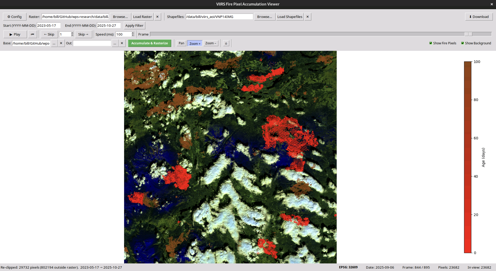

# WPS Research — Bill's Toolkit

A collection of remote sensing tools for wildfire analysis using Sentinel-2 and VIIRS satellite data.

---

## [VIIRS Hotspot Processing](https://github.com/bcgov/wps-research/tree/master/data/bill/viirs)

An end-to-end pipeline for downloading, converting, and visualising VIIRS active fire pixel data (VNP14IMG). Downloads raw NetCDF files from NASA LAADS DAAC, reprojects fire pixels to match a Sentinel-2 reference raster, and loads them into an interactive GUI. Supports accumulation of fire pixels over a date range and rasterization onto the Sentinel-2 grid to produce binary fire masks for burn severity mapping.

---

## [Sentinel-2 Fire Mapping](https://github.com/bcgov/wps-research/blob/master/data/bill/fire_mapping/README.md)

A lightweight toolkit for fire-mapping workflows using Sentinel-2 raster data. Provides utilities for reading and extracting raster bands, masking pixels inside/outside fire perimeters, sampling strategies (random, in/out polygon, regular), band dominance analysis, and generating PNG thumbnails. Modules are self-contained and can be imported directly into scripts.

---

## [Sentinel-2 Cloud Masking](https://github.com/bcgov/wps-research/tree/master/data/bill/cloud_masking)

A multi-stage pipeline for per-date Sentinel-2 cloud masking using Random Forest regression. Trains an RF model on image/cloud-probability-mask pairs to predict cloud probability maps, then optionally sets masked pixels to NaN, runs MRAP compositing, and generates an MP4. Includes an interactive review step so results can be inspected before committing to the full pipeline.
