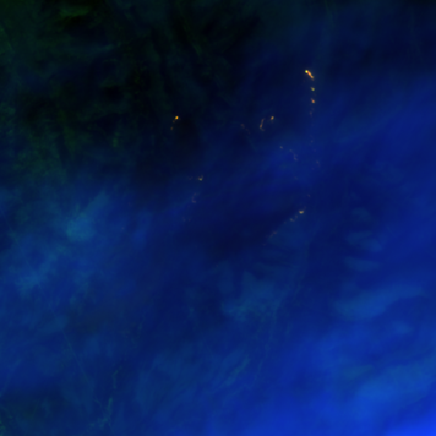
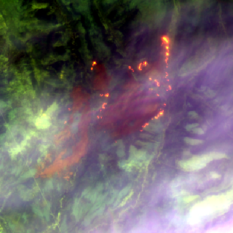
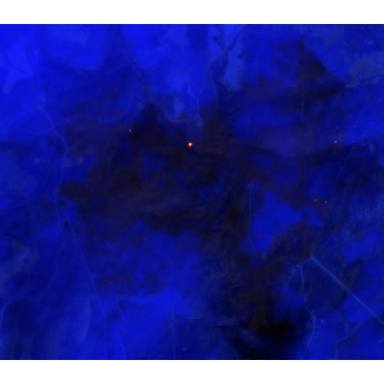
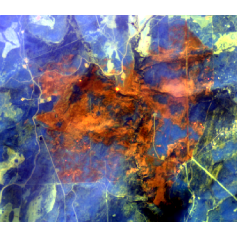

# Sentinel-2 (SWIR bands only) fire data
First example includes non-uniform smoke/haze. Second example has haze and some strong shadow at SouthEast corner.

## To run:
```
Rscript view.R
```

May need to 
```
install.packages('raster') 
```
first.

## Outputs:

|   | Linear scaling  | Histogram trimming  |
|---|---|---|
| G90292  |   |  |
| G80223  |  |  |

