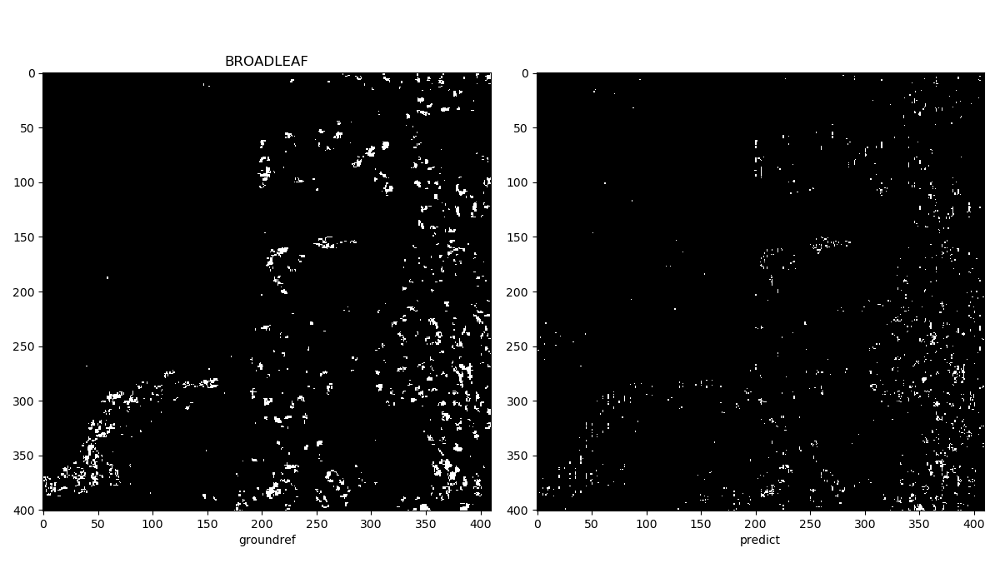
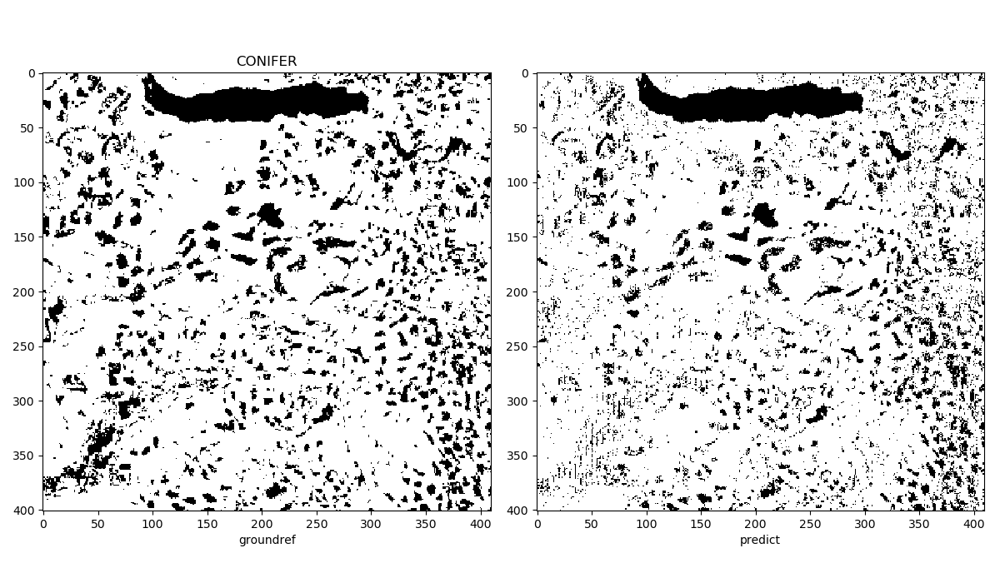
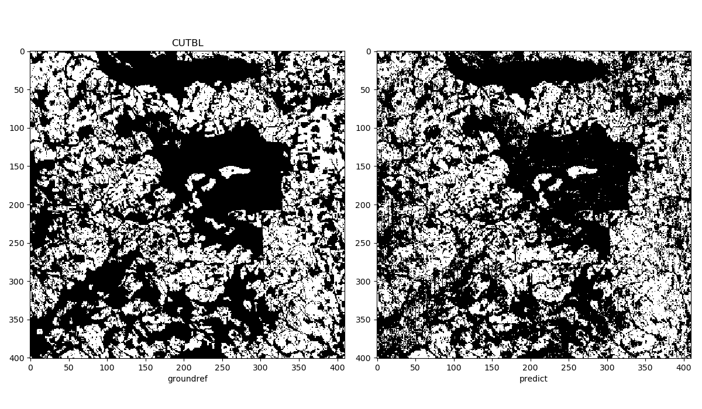
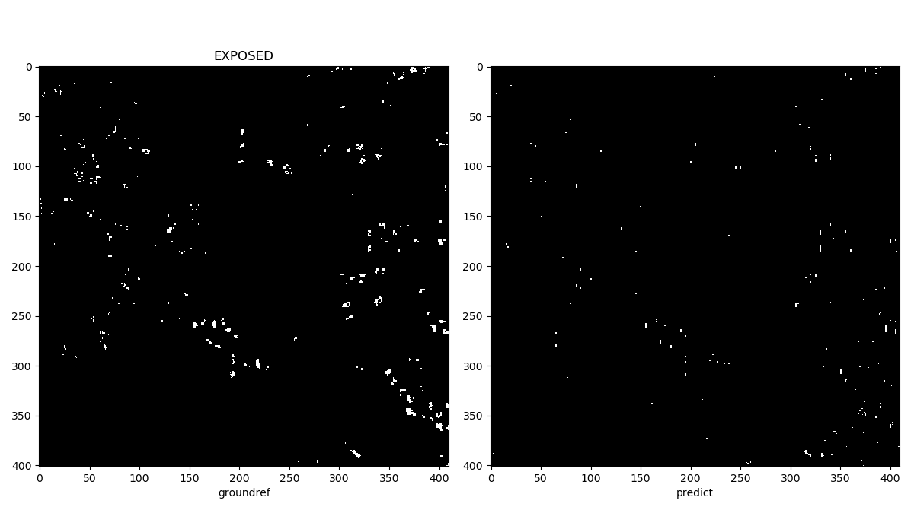
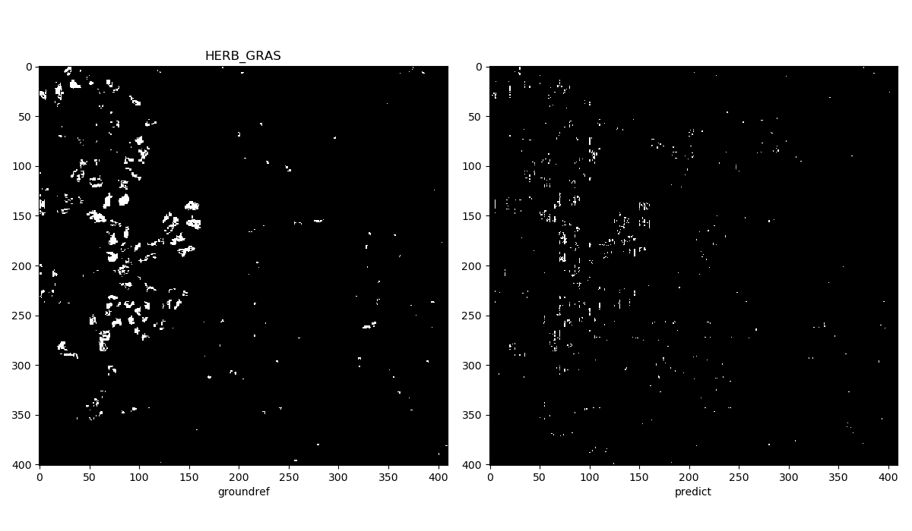
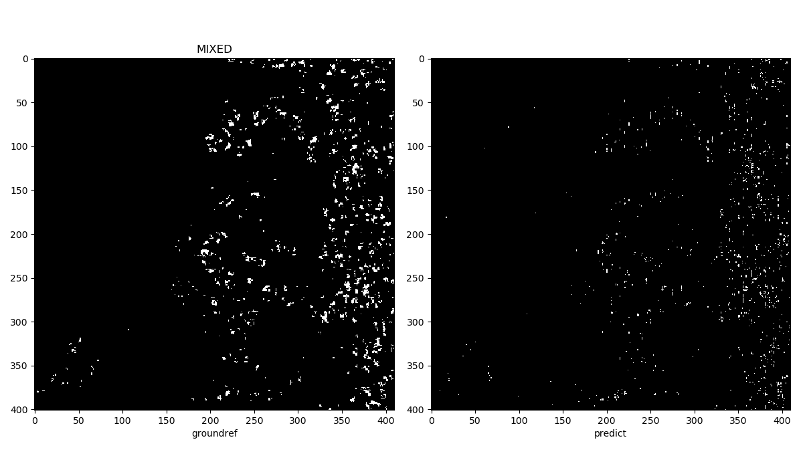
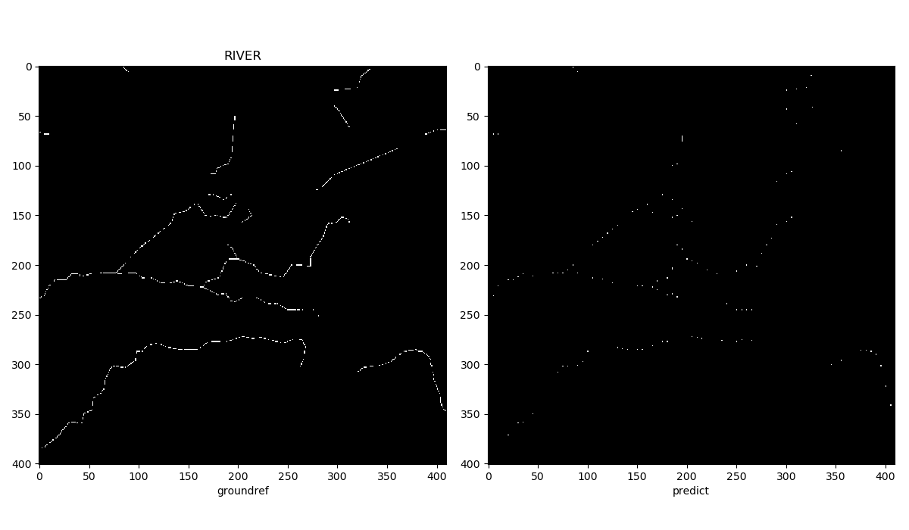
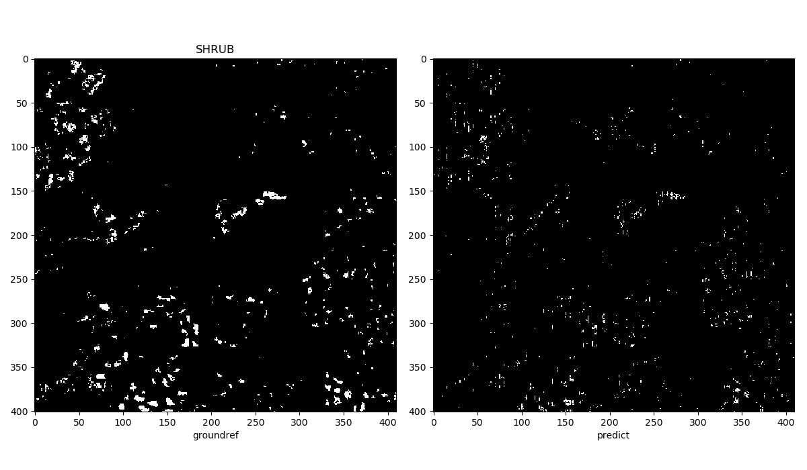
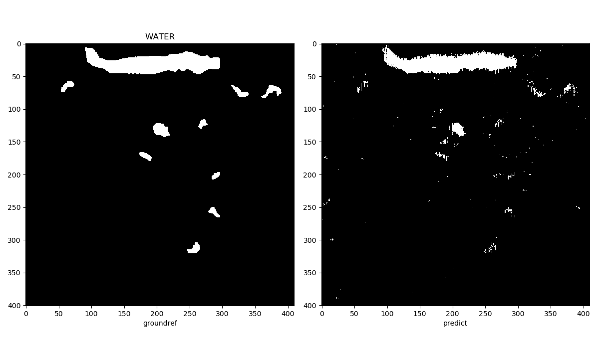

**Random forest demo**
[Source Code](rf_stack.py)
S2 image and BCGW groundref are in stack.tar.gz. 20% of pixels were selected for training and seven estimators were used. To run:
```
python3 -m "pip install scikit-learn"
python3 rf_stack.py
```










