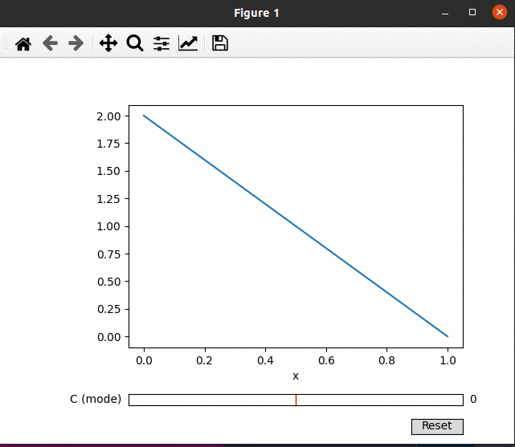

# Triangle slider example
**Plot the PMF of [Triangular distribution](https://en.wikipedia.org/wiki/Triangular_distribution) and vary a parameter using a "slider"**
* Web server not used
* Single source code file
* Using the most basic dependencies

## R version
### How to install the pre-requisites (at R prompt)
```
install.packages(c("tcltk","tkrplot","extraDistr"))
```
### How to run (at R prompt)
Assuming your triangle_slider.R is saved in your present working directory, you can run the example at the R prompt by:
```
source("triangle_slider.R")
```
* [Click here for R code](https://github.com/bcgov/wps-research/blob/master/doc/emily/triangle_slider.R)


## Python version
* [Click here for Python code](https://github.com/bcgov/wps-research/blob/master/doc/emily/triangle_slider.py)
* Dependencies automatically installed, assuming you have Python3 installed already

### Python version example output


### References
Based on samples from:
* [Matplotlib slider demo](https://matplotlib.org/stable/gallery/widgets/slider_demo.html)
* [Scipy stats: triangular distribution](https://docs.scipy.org/doc/scipy/reference/generated/scipy.stats.triang.html)
