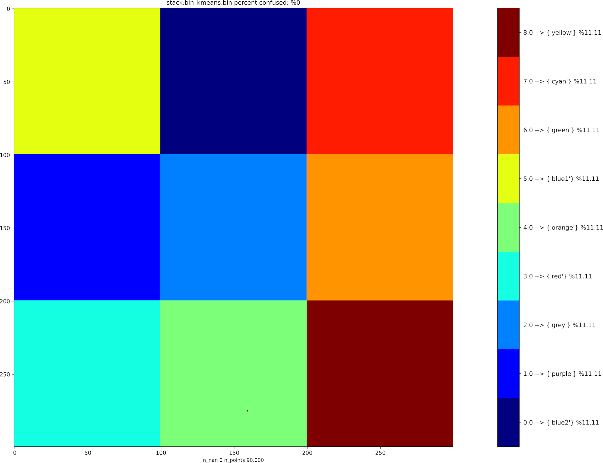

## Synthetic multispectral "chessboard" data
* Synthetic multispectral data generated by https://github.com/bcgov/wps-research/blob/master/py/raster_synthetic_data.py
* includes spectral noise, and one-hot encoded class bands which include some spatial overlap (the class bands were removed for the semi-supervised classification session below..)

### Files
* **stack.bin**: the image data
* **stack.hdr**: image header (metadata) incl. dimensions
* **stack.bin_targets.csv**: targets selected by manual annotation using imv (delete this to try from scratch)..

## Semi-supervised classification session using imv
At terminal, cd to this folder then type **imv** and press return

### Classification result

