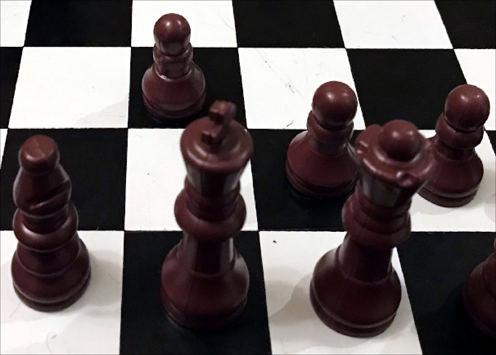

## Real "chessboard" data

### Files
* **stack.bin**: the image data
* **stack.hdr**: image header (metadata) incl. dimensions
* **stack.bin_targets.csv**: targets selected by manual annotation using imv (delete this to try from scratch)..

## Semi-supervised classification session using imv
At terminal, cd to this folder then type **imv** and press return

### Classification result

