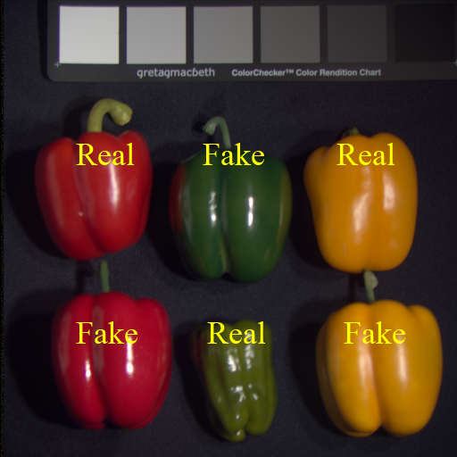

## Multispectral "real and fake peppers" data

### Files
* **stack.bin**: the image data
* **stack.hdr**: image header (metadata) incl. dimensions
* **stack.bin_targets.csv**: targets selected by manual annotation using imv (delete this to try from scratch)..



## Semi-supervised classification session using imv
At terminal, cd to this folder then type **imv** and press return


### Classification result

# Notes
* Dark things get confused (see c4, c5 labels) in legend
* The real vs fake yellow peppers are harder to separate (right) than the real vs fake orange peppers (left)
* band selection using the following commands:
```
 r 30<press return> g 20 <press return> b 10<press return>
``` 
